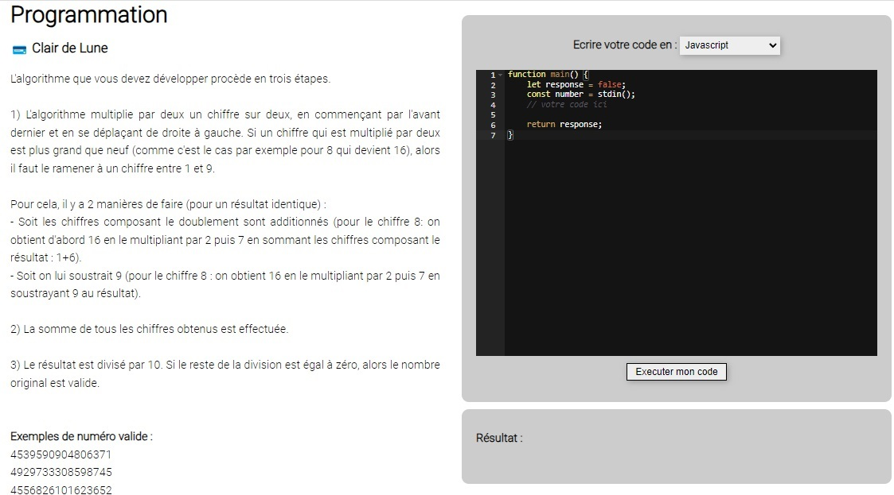

# CTF Programmation - Claire de lune

## Présentation du CTF 
**ID** 24 dans **les CTFs de Cyrhades**

Créez un algorithme qui vous retournera si une chaine numerique retourne vrai à l'algorithme de Luhn

L'algorithme de Luhn peut valider la cohérence des numéros de SIREN et de cartes bancaire par exemple.

## Aperçu

-----------

## Installation manuel
Vous n'utilisez pas l'application **les CTFs de Cyrhades** ? C'est dommage !
Mais voici comment installer ce CTF manuellement :

> git clone https://github.com/Hack-Oeil/CLAIRE_DE_LUNE.git

> cd CLAIRE_DE_LUNE && docker compose up

